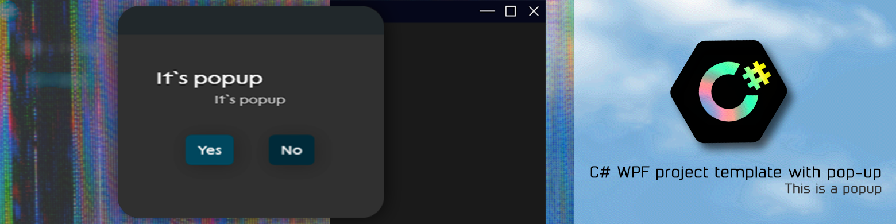

### **Languages**

  [](Readme.ru-RU.md)
  [](Readme.md)

# **Pop-up project template**

## **Screenshots**


## **Content**
 * [**Description of the project**](Readme.md#Description-of-the-project)

 * [**Installation**](Readme.md#Installation)

 * [**Description of structure**](Readme.md#Description-of-structure)

 * [**Description of interaction with the application theme**](Readme.md#Description-of-interaction-with-the-application-theme)

    - [Color changes](Readme.md#Change-colors)
    - [Changing icons](Readme.md#Changing-icons)
    - [Changing fonts](Readme.md#Changing-fonts)
    - [Resizing](Readme.md#Resizing)

 * [**Description of interaction with localization files**](Readme.md#Description-of-interaction-with-localization-files)

    - [Adding lines](Readme.md#Adding-lines)
    - [Description of the operation of the localization function](Readme.md#Description-of-the-operation-of-the-localization-function)

 * [**Description of interaction with pop-ups**](Readme.md#Description-of-interaction-with-pop-ups)

    - [Description of pop-up mechanics](Readme.md#Description-of-pop-up-mechanics)
    - [Calling a pop-up from above](Readme.md#Calling-a-pop-up-from-above)
    - [Pop-up call](Readme.md#Pop-up-call)

 * [**Keyboard shortcuts**](Readme.md#Keyboard-shortcuts)

    - [Adding a keyboard shortcut](Readme.md#Adding-a-keyboard-shortcut)

 * [**Conclusion**](Readme.md#Conclusion)

## **Project description**
This project is a simple template for C# WPF applications that includes the following basic functions:

  * Beautiful pop-up display
  * Saving window settings
  * Possibility of localization
  * Adding a keyboard shortcut

Also this project by default uses __MaterialDesignThemes.Wpf__ and __MaterialDesignColors.Wpf__

And also __.NetFramework 4.7.2__

## **Installation**
You do not need to re-write the basic structures and functions every time you create a project. Just download this repository

```console
git clone https://github.com/kenuel0110/-WPF-C-Window-Template-With-Popup.git
```

## **Description of structure**
This template already has some structure that you can customize to suit your needs.
***
``Classes`` folder structure

<div style="border: 1px solid black; padding: 10px; margin-bottom: 20px;">
     <ul>
         <li>Classes</li>
         <ul>
             <li>Constants.cs</li>
             <li>Data_Classes.cs</li>
             <li>Enums.cs</li>
         </ul>
     </ul>
</div>

***
The ```Classes``` folder contains classes and constants used in the application

> Constants.cs - This file contains all the names of folders and files, as well as the names of the resource for the ```FindResource()``` function

> Data_Classes.cs - This file contains all the classes for generating and reading JSON, as well as internal classes

> Enums.cs - This file contains all the "enumerations" used within the program
***
Folder structure ```Fonts```

<div style="border: 1px solid black; padding: 10px; margin-bottom: 20px;">
     <ul>
         <li>Fonts</li>
         <ul>
             <li>Lackitalic.ttf</li>
             <li>Lackregular.ttf</li>
         </ul>
     </ul>
</div>

***
The ```Fonts``` folder contains all the fonts used by the application
***
```Funcs``` folder structure

<div style="border: 1px solid black; padding: 10px; margin-bottom: 20px;">
     <ul>
         <li>Functions</li>
         <ul>
             <li>MainWindow_Funcs.cs</li>
             <li>Popups_Funcs.cs</li>
         </ul>
     </ul>
</div>

***
The ```Funcs``` folder contains all the application helper functions

> MainWindow_Funcs.cs - This file contains all the functions used within ```MainWindow.xaml.cs``` and associated with the main window

> Popups_Funcs.cs - This file contains all the functions used inside pop-ups and associated with them
***

```Icons``` folder structure

<div style="border: 1px solid black; padding: 10px; margin-bottom: 20px;">
     <ul>
         <li>Icons</li>
         <ul>
             <li>btn_close.png</li>
             <li>btn_hide.png</li>
             <li>btn_maximilize.png</li>
             <li>btn_restore.png</li>
             <li>logo_window.png</li>
         </ul>
     </ul>
</div>

***
The ```Icons``` folder contains all the icons used inside the application
***
```Pages`` folder structure

<div style="border: 1px solid black; padding: 10px; margin-bottom: 20px;">
     <ul>
         <li>Pages</li>
         <ul>
             <li>Page_main.xaml</li>
             <li>Page_main.xaml.cs</li>
         </ul>
     </ul>
</div>

***
The ```Pages``` folder contains all the pages used in the application

> Page_main - the main page of the application, which opens first inside the window
***
```Popups`` folder structure

<div style="border: 1px solid black; padding: 10px; margin-bottom: 20px;">
     <ul>
         <li>Popups</li>
         <ul>
             <li>Popup_question.xaml</li>
             <li>Popup_question.xaml.cs</li>
             <li>Popup_slidedown_info.xaml</li>
             <li>Popup_slidedown_info.xaml.cs</li>
         </ul>
     </ul>
</div>

***
The ```Popups``` folder contains all the pop-ups used within the application. They are implemented in the form of pages for ease of working with them.

> Popup_question - This popup is a standard "YES/NO" dialogue popup

> Popup_slidedown_info - This pop-up is a pop-up that slides out from above to display any text
***
Folder structure ```Strings```

<div style="border: 1px solid black; padding: 10px; margin-bottom: 20px;">
     <ul>
         <li>Strings</li>
         <ul>
             <li>Strings.en-EN.xaml</li>
             <li>Strings.ru-RU.xaml</li>
         </ul>
     </ul>
</div>

***
The ```Strings``` folder contains all the resources used to localize the application

> Strings.en-EN.xaml - This file contains all the lines in English

> Strings.ru-RU.xaml - This file contains all the lines in Russian
***

File structure inside the root folder ```WindowTemplateWithPopup```

<div style="border: 1px solid black; padding: 10px; margin-bottom: 20px;">
     <ul>
         <li>App.config</li>
         <li>App.xaml</li>
         <li>App.xaml.cs</li>
         <li>MainWindow.xaml</li>
         <li>MainWindow.xaml.cs</li>
         <li>packages.config</li>
     </ul>
</div>

> App.xaml - This file contains the entire theme for the application, that is, all the colors, fonts, sizes, etc.

> App.xaml.cs - This file contains functions related to localization

> MainWindow - This is the main window of the application

## **Description of interaction with the application theme**

### Color Changes

```xml
<!--App.xaml-->
<!--Colors-->
<Color x:Key="PrimaryColor">#FF8C1857</Color>
<Color x:Key="SecondaryColor">#FF520931</Color>
<Color x:Key="Background">#202020</Color>
<Color x:Key="Background_Dark">#0e101f</Color>
<Color x:Key="Background_Popup">#333333</Color>
<Color x:Key="Background_Button_TitleBar">#3f3f41</Color>
<Color x:Key="Background_Button_Hover_TitleBar">#3f3f41</Color>
<Color x:Key="Background_Button_Close">#6a000d</Color>
<Color x:Key="Background_Button_Main">#1d495d</Color>
<Color x:Key="Background_Button_Accent">#122E3B</Color>
<Color x:Key="Background_Button_Hover_Accent">#0E212A</Color>
<Color x:Key="Background_Button_Hover_Main">#091820</Color>
<Color x:Key="Background_Context_menu">#FF222222</Color>
<Color x:Key="Foreground_Header">#f1f1f1</Color>
<Color x:Key="Foreground_Text">#bebebe</Color>
<Color x:Key="Background_Popup_Titlebar">#282c2f</Color>
```
> This block inside ```App.xaml``` is responsible for changing the colors of the application

Structure:

* ```Background/Foreground/etc.``` marks where the color will be displayed
* ```Text/Header/Button/etc.``` marks the element where the color will be displayed
* the ```_Hover_``` tag marks the hover color
* the note ```_Accent_``` marks a more accent color for possible interface elements

### Changing icons
```xml
<!--App.xaml-->
<!--Icons-->
<BitmapImage x:Key="ic_logo" UriSource="/Icons\logo_window.png"/>
<BitmapImage x:Key="ic_hide" UriSource="/Icons\btn_hide.png"/>
<BitmapImage x:Key="ic_maximilize" UriSource="/Icons\btn_maximilize.png"/>
<BitmapImage x:Key="ic_close" UriSource="/Icons\btn_close.png"/>
<!--=====-->
```
> This block inside ```App.xaml``` is responsible for adding images and convenient access to them inside application resources

### Changing fonts
```xml
<!--App.xaml-->
<!--Fonts-->
<FontFamily x:Key="LackRegular">/Fonts/Lackregular.ttf #Lack Regular</FontFamily>
<FontFamily x:Key="LackItalic">/Fonts/Lackitalic.ttf #Lack Italic</FontFamily>
<!--=====-->
```
> This block inside ```App.xaml``` is responsible for adding fonts and convenient access to them inside application resources

### Resizing
```xml
<!--App.xaml-->
<!--Sizes-->
<CornerRadius x:Key="size_CornerRadiusValue">25</CornerRadius>
<CornerRadius x:Key="size_CornerRadiusSlidedownPopup">8</CornerRadius>
<CornerRadius x:Key="size_CornerRadiusPopupTitlebar">25 25 0 0</CornerRadius>
<CornerRadius x:Key="size_CornerRadiusButton">5</CornerRadius>
<sys:Double x:Key="size_textblock_header">18</sys:Double>
<sys:Double x:Key="size_textblock_text">14</sys:Double>
<sys:Double x:Key="size_textblock_title_window">12</sys:Double>
<sys:Double x:Key="size_button_text">13</sys:Double>
<sys:Double x:Key="size_control_button_height">34</sys:Double>
<sys:Double x:Key="size_control_button_width">34</sys:Double>
<sys:Double x:Key="size_control_popup_button_height">24</sys:Double>
<sys:Double x:Key="size_control_popup_button_width">24</sys:Double>
<Thickness x:Key="size_control_image_margin">6</Thickness>
<sys:Double x:Key="size_shadow_button">6</sys:Double>
<sys:Double x:Key="size_shadow_depth_button">3</sys:Double>
<sys:Double x:Key="size_shadow_opacity_button">0.2</sys:Double>
<Thickness x:Key="size_small_padding">5</Thickness>
<Thickness x:Key="size_medium_padding">25</Thickness>
<sys:Double x:Key="size_minheight">64</sys:Double>
<sys:Double x:Key="size_minwidth">128</sys:Double>
<Thickness x:Key="size_small_margin">5</Thickness>
<Thickness x:Key="size_medium_margin">25</Thickness>
<!--=====-->
```
> This block inside ```App.xaml``` is responsible for templates for the sizes of various user interface elements

Structure:

* ```size``` indicates that this is the size
* the postscript ```medium / small / etc.``` indicates the strength of the indentation
* ```control_image / padding / etc.``` marks the element where the size will be applied

### Adding languages

```xml
<!--App.xaml-->
<ResourceDictionary.MergedDictionaries>

     <!--Language-->
     <ResourceDictionary Source="/Strings/Strings.en-EN.xaml"/>
     <ResourceDictionary Source="/Strings/Strings.ru-RU.xaml"/>
     <!--========-->

     <!-- ... -->

</ResourceDictionary.MergedDictionaries>
```
> This block inside ```App.xaml``` is responsible for adding localization files inside application resources

   >__[IMPORTANT INFORMATION ABOUT THE STRUCTURE AND NAMES OF LOCALIZATION FILES](Readme.md#important-information)__

### Resizing
```xml
<!--App.xaml-->
<!--Sizes-->
<ResourceDictionary.MergedDictionaries>

     <!-- ... -->

     <ResourceDictionary Source="pack://application:,,,/MaterialDesignThemes.Wpf;component/Themes/MaterialDesignTheme.Light.xaml" />
     <ResourceDictionary Source="pack://application:,,,/MaterialDesignThemes.Wpf;component/Themes/MaterialDesignTheme.Defaults.xaml" />
     <ResourceDictionary Source="pack://application:,,,/MaterialDesignColors;component/Themes/Recommended/Primary/MaterialDesignColor.DeepPurple.xaml" />
     <ResourceDictionary Source="pack://application:,,,/MaterialDesignColors;component/Themes/Recommended/Accent/MaterialDesignColor.Lime.xaml" />
     <materialDesign:CustomColorTheme BaseTheme="Dark" PrimaryColor="#1d495d" SecondaryColor="#122e3b" />

</ResourceDictionary.MergedDictionaries>
```
> This block inside ```App.xaml``` is responsible for adding MaterialDesign to the project, and also allows you to select ```PrimaryColor``` and ```SecondaryColor``` for the application (these colors are responsible for some non-editable interface elements, such as the ComboBox arrow, etc.)

## **Description of interaction with localization files**

### Adding lines
```xml
<!--Strings.en-EN.xaml-->
<ResourceDictionary xmlns="http://schemas.microsoft.com/winfx/2006/xaml/presentation"
xmlns:x="http://schemas.microsoft.com/winfx/2006/xaml"
xmlns:system="clr-namespace:System;assembly=mscorlib"
xmlns:local="clr-namespace:WindowTemplateWithPopup.Strings">
     <!--Title window-->
     <system:String x:Key="window_title">Window template with "Pop-up"</system:String>
     <!--Window file button button-->
     <system:String x:Key="window_btn_file">File</system:String>
     <!--Change language combobox-->
     <system:String x:Key="cb_select_language">Select language</system:String>
     <!--Greeteng string-->
     <system:String x:Key="greeteng">Hello, it`s page of Main Window</system:String>
     <!--Button "open popup" string-->
     <system:String x:Key="btn_open_popup">Open Popup</system:String>
     <!--Button "open small slide-down popup" string-->
     <system:String x:Key="btn_open_small_popup">Open slide-down Popup</system:String>
     <!--Button "change language" string-->
     <system:String x:Key="button_change_language">Change Language</system:String>
     <!--Greeteng popup string-->
     <system:String x:Key="popup_greeteng">It`s popup</system:String>
     <!--Window menu "new file" string-->
     <system:String x:Key="window_menu_new">New</system:String>
     <!--Window menu "Open file..." string-->
     <system:String x:Key="window_menu_open">Open...</system:String>
     <!--Window change language-->
     <system:String x:Key="window_change_language">Restart app to set changes</system:String>
     <!--Popup button accept-->
     <system:String x:Key="popup_accept">Yes</system:String>
     <!--Popup button cancel-->
     <system:String x:Key="popup_cancel">No</system:String>
</ResourceDictionary>
```
> This block inside ```Strings.en-EN.xaml``` is responsible for adding localized strings to the project

Structure:

<div style="border: 1px solid black; padding: 10px; margin-bottom: 20px;">
     <ul>
         <li>&lt;ResourceDictionary&gt;</li>
         <ul>
             <li>&lt;system:String x:Key="1"&gt;1&lt;/system:String&gt;</li>
             <li>&lt;system:String x:Key="2"&gt;2&lt;/system:String&gt;</li>
              <li>&lt;system:String x:Key="3"&gt;3&lt;/system:String&gt;</li>
             <li>...</li>
             <li>&lt;system:String x:Key="n"&gt;n&lt;/system:String&gt;</li>
         </ul>
         <li>&lt;/ResourceDictionary&gt;</li>
     </ul>
</div>

The file ```Strings.nn-NN.xaml``` where ```nn-NN``` is the language code, contains all the lines used in the application in the ```nn-NN`` language

> ```x:Key=""``` - This is the key for the line

> ```<system:String>...</system:String>``` - a line is written between these tags

__Keys to lines in different languages must match, that is:__

<div style="border: 1px solid black; padding: 10px; margin-bottom: 20px;">
     <b>Strings.en-EN.xaml</b>
     <br><br>
     <ul>
         <li>&lt;ResourceDictionary&gt;</li>
         <ul>
             <li>&lt;system:String x:Key="one"&gt;<b>one</b>&lt;/system:String&gt;</li>
             <li>&lt;system:String x:Key="two"&gt;<b>two</b>&lt;/system:String&gt;</li>
              <li>&lt;system:String x:Key="three"&gt;<b>three</b>&lt;/system:String&gt;</li>
             <li>&lt;system:String x:Key="four"&gt;<b>four</b>&lt;/system:String&gt;</li>
         </ul>
         <li>&lt;/ResourceDictionary&gt;</li>
     </ul>
     <br>
     <br>
     <b>Strings.ru-RU.xaml</b>
     <br><br>
     <ul>
         <li>&lt;ResourceDictionary&gt;</li>
         <ul>
             <li>&lt;system:String x:Key="one"&gt;<b>один</b>&lt;/system:String&gt;</li>
             <li>&lt;system:String x:Key="two"&gt;<b>два</b>&lt;/system:String&gt;</li>
              <li>&lt;system:String x:Key="three"&gt;<b>три</b>&lt;/system:String&gt;</li>
             <li>&lt;system:String x:Key="four"&gt;<b>четыре</b>&lt;/system:String&gt;</li>
         </ul>
         <li>&lt;/ResourceDictionary&gt;</li>
     </ul>

</div>

### __!Important information!__

>__Localization files must be located in the ```Strings/``` folder and have the following name structure:__

<div style="border: 1px solid black; padding: 10px; margin-bottom: 20px;">
<b>Strings.LANGUAGE_TAG.xaml</b>
</div>

Where __LANGUAGE_TAG__ is ```language abbreviation-region abbreviation``` like:
<div style="border: 1px solid black; padding: 10px;">
     <ul>
         <li>ru-RU</li>
         <li>en-EN</li>
         <li>fr-FR</li>
     </ul>
     <b Style="margin-left: 25px;">etc.</b>
</div>

### Description of the localization function
```C#
//App.xaml.cs
static void SelectCulture(string culture)
{
     MainWindow mainWindow = App.Current.MainWindow as MainWindow;
     if (String.IsNullOrEmpty(culture))
         return;
     // Copy all MergedDictionarys to the auxiliary list.
     var dictionaryList = Application.Current.Resources.MergedDictionaries.ToList();
     // Search for the specified culture.
     string requestedCulture = string.Format("/Strings/Strings.{0}.xaml", culture);
     var resourceDictionary = dictionaryList.FirstOrDefault(d =>
     d.Source != null &&
     !string.IsNullOrEmpty(d.Source.OriginalString) &&
     d.Source.OriginalString == requestedCulture);
     if (resourceDictionary == null)
     {
         // If not found, select our default language.
         requestedCulture = "/Strings/Strings.en-EN.xaml";
         resourceDictionary = dictionaryList.FirstOrDefault(d =>
             d.Source != null &&
             !string.IsNullOrEmpty(d.Source.OriginalString) &&
             d.Source.OriginalString == requestedCulture);
     }
     // If we have the requested resource, remove it from the list and place it at the end.
     // This language will then become our string table to use.
     if (resourceDictionary != null)
     {
         Application.Current.Resources.MergedDictionaries.Remove(resourceDictionary);
         Application.Current.Resources.MergedDictionaries.Add(resourceDictionary);
     }
     // Inform threads about the new culture.
     Thread.CurrentThread.CurrentCulture = new CultureInfo(culture);
     Thread.CurrentThread.CurrentUICulture = new CultureInfo(culture);
     mainWindow.systemLanguage = culture;
}
```

The ```App.SelectCulture()``` function needs to pass the language tag whose language the user wants to install in the program

> In this template the default language is English, but this can be easily changed by registering another file

This template provides a simple implementation of language selection based on the languages that are specified in the resources

To search for languages specified in the application resources, use the ```App.availableCultures()``` function

```C#
//App.xaml.cs
public static List<string> availableCultures()
{
     List<string>availableCultures = new List<string>();
     var dictionaryList = Application.Current.Resources.MergedDictionaries.ToList();
     try
     {
         foreach (ResourceDictionary dictionary in dictionaryList)
         {
             string source = dictionary.Source.OriginalString;
             if (source.StartsWith("/Strings/Strings.") && source.EndsWith(".xaml"))
             {
                 string cultureCode = source.Substring(17, source.Length - 22); // Get the language tag
                 availableCultures.Add(cultureCode);
             }
         }
     }
     catch { }
     return availableCultures;
}
```

The ```App.availableCultures()``` function returns a list of language tags, a localization file that is included in the application resources

> It is important to run this function before loading the main window so that the program has access to all localization files, otherwise the already selected application language will be skipped and will not appear in the list!

***

```C#
//MainWindow.xaml.cs
public void localization(string language_state)
{
     App.SelectCulture(language_state);
     mainwindow_funcs.saveJSONSetting(
         new Classes.Data_Classes.JSON_Setting
         {
             maximilize_window = window_state,
             size_window = new List<double>() { newWindowHeight, newWindowWidth },
             position_window = new List<double>() { newWindowPosX, newWindowPosY },
             window_language = language_state
         })
     //reastart app
     System.Windows.Application.Current.Shutdown();
     Thread.Sleep(100);
     System.Diagnostics.Process.Start(Application.ResourceAssembly.Location);
}
```

This template presents a simple system that allows you not only to change the application culture, but also to update interface elements

The ```localization()``` function is located in ```MainWindow.xaml.cs``` and immediately after changing the culture, it automatically restarts the application to update all interface elements

> To get a string from application resources in code you need to use the ```FindResource()``` function

```C#
//manually updating some interface elements
title_window.Text = FindResource(constants.window_title).ToString();
btn_file.Content = FindResource(constants.window_btn_file).ToString();
btn_file_new.Header = FindResource(constants.window_menu_new).ToString();
btn_file_open.Header = FindResource(constants.window_menu_open).ToString();
```

For convenience, all resource keys are registered in ```Classes.Constants.cs```

> To get a string from application resources in markup you need to contact ```StaticResource```

```xml
<Button.ContextMenu>
     <ContextMenu Name="btn_file_cm" Style="{StaticResource button_menu_context_menu}">
         <MenuItem Name="btn_file_new" Header="{StaticResource window_menu_new}"/>
         <MenuItem Name="btn_file_open" Header="{StaticResource window_menu_open}"/>
     </ContextMenu>
</Button.ContextMenu>
```

## **Description of interaction with pop-ups**

### Description of pop-up mechanics

The mechanics of pop-ups work as follows. Three ```Frame``` elements have been created inside ```MainwWindow.xaml```:
* __main_frame__
* __popup_slide_frame__
* __popup_frame__

```main_frame``` — The main frame in which pages are opened

```popup_slide_frame``` — Frame in which the pop-up that drops down from above opens

```popup_frame``` — Frame in which regular pop-ups are opened (pop-up windows)

There is also a ```Border``` element called ```border_shadow```, it is needed to add a darkening effect when opening pop-ups

> Essentially, all pop-ups are the same pages, which allows you to make them separate from the content of the page or window in which it should be used, and also allows you to reuse the same pop-up in different situations

By default, all additional ```Frame``` are not displayed (only ```main_frame``` is displayed), as well as ```border_shadow```, appearing only when needed

### Calling a pop-up from above
The pop-up that drops down from above is called using the ```Funcs.Popups_Funcs.showpopup()``` function. It accepts the type of pop-up and the information that needs to be displayed

```C#
//Funcs.Popups_Funcs
public async void showpopup(Classes.Enums.Popups popup = Classes.Enums.Popups.None, string info = "")
{
     switch (popup)
     {
         case Classes.Enums.Popups.SlideDown:
             mainWindow.popup_slide_frame.Visibility = Visibility.Visible;
             mainWindow.popup_slide_frame.NavigationService.Navigate(new Popups.Popup_slidedown_info(info));
             break
         case Classes.Enums.Popups.Popup:
             bool result = await mainWindow.open_popup();
             if (result == true)
             {
                 showpopup(Classes.Enums.Popups.SlideDown, info.Split()[0].ToString());
             }
             else
             {
                 showpopup(Classes.Enums.Popups.SlideDown, info.Split()[1].ToString());
             }
             break;
     }
}
```

> All types of pop-ups are registered in ```Classes.Enums.cs```

```C#
//Classes.Enums.cs
public enum Popups
{
     None = 0,
     SlideDown = 1,
     Popup = 2
}
```

At the moment there are three of them:
* None - Empty
* SlideDown - Pop-up that drops down from above
* Popup - Pop-up window

> In this template, the pop-up is designed as a YES/NO dialog box, but it can be divided into several more types if you need

To display a pop-up that drops down from above, just call the function ```Funcs.Popups_Funcs.showpopup()``` with the pop-up type ```Classes.Enums.Popups.SlideDown```

```Page_main.xaml.cs
private void btn_open_small_popup_Click(object sender, RoutedEventArgs e)
{
     popups_funcs.showpopup(Classes.Enums.Popups.SlideDown, FindResource(constants.popup_greeteng).ToString());
}
```

In this case, the pop-up ```Popups.Popup_slidedown_info``` will open

To close the pop-up that drops down from above, use the function ```Funcs.Popups_Funcs.hideslidedownpopup()```

### Pop-up call
The pop-up is called using the function ```Funcs.Popups_Funcs.showpopup()```. It accepts the type of pop-up and the information that needs to be displayed

```C#
//Funcs.Popups_Funcs
public async void showpopup(Classes.Enums.Popups popup = Classes.Enums.Popups.None, string info = "")
{
     switch (popup)
     {
         case Classes.Enums.Popups.SlideDown:
             mainWindow.popup_slide_frame.Visibility = Visibility.Visible;
             mainWindow.popup_slide_frame.NavigationService.Navigate(new Popups.Popup_slidedown_info(info));
             break
         case Classes.Enums.Popups.Popup:
             bool result = await mainWindow.open_popup();
             if (result == true)
             {
                 showpopup(Classes.Enums.Popups.SlideDown, info.Split()[0].ToString());
             }
             else
             {
                 showpopup(Classes.Enums.Popups.SlideDown, info.Split()[1].ToString());
             }
             break;
     }
}
```

> All types of pop-ups are registered in ```Classes.Enums.cs```

```C#
//Classes.Enums.cs
public enum Popups
{
     None = 0,
     SlideDown = 1,
     Popup = 2
}
```

At the moment there are three of them:
* None - Empty
* SlideDown - Pop-up that drops down from above
* Popup - Pop-up window

> In this template, the pop-up is made in the form of a YES/NO dialog box, but it can be divided into several more types if you need

To display a pop-up, just call the function ```Funcs.Popups_Funcs.showpopup()``` with the pop-up type ```Classes.Enums.Popups.Popup```

```C#
//Page_main.xaml.cs
private void btn_open_popup_Click(object sender, RoutedEventArgs e)
{
     popups_funcs.showpopup(Classes.Enums.Popups.Popup, FindResource(constants.popup_accept) + " " + FindResource(constants.popup_cancel));
}
```

In this case, the pop-up ```Popups.Popup_question``` will open

> In this template, the implementation of the dialog pop-up is done using an event created using ```TaskCompletionSource``` in ```MainWindow.xaml.cs```

```C#
//MainWindow.xaml.cs
//pop-up opening function
public async Task<bool> open_popup()
{
     blurBackground();
     popup_frame.Visibility = Visibility.Visible;
     Popups.Popup_question popup_question = new Popups.Popup_question();
     popup_frame.NavigationService.Navigate(popup_question);
     tcs = new TaskCompletionSource<bool>()
     // wait until the variable changes
     bool result = await tcs.Task;
     return result;
}
```

> Until the ```result``` variable changes, the program will not continue. That is, until the user clicks on the dialog button and changes the ```result``` the pop-up will not close, implementing the dialog functionality

To change the ```result``` variable in the pop-up file (in this case ```Popups.Popup_question.xaml.cs```), we need to call the ```MainWindow.xaml.cs``` function called ```SetDialogResult_popup()```

```C#
//Popups.Popup_question.xaml.cs
//Function of the "yes" button
private void btn_accept_Click(object sender, RoutedEventArgs e)
{
     mainWindow.popup_frame.Visibility = Visibility.Hidden;
     mainWindow.deblurBackground();
     if (NavigationService.CanGoBack)
         NavigationService.GoBack();
     ((MainWindow)Application.Current.MainWindow).SetDialogResult_popup(true);
}

//Function of the "no" button
private void btn_cancel_Click(object sender, RoutedEventArgs e)
{
     mainWindow.popup_frame.Visibility = Visibility.Hidden;
     mainWindow.deblurBackground();
     if (NavigationService.CanGoBack)
         NavigationService.GoBack();
     ((MainWindow)Application.Current.MainWindow).SetDialogResult_popup(false);
}
```

For each pop-up, ```MainWindow.xaml.cs``` should have its own function ```SetDialogResult_popup()```, which looks like this

```C#
//MainWindow.xaml.cs
internal void SetDialogResult_popup(bool result)
{
     setdialogResult_popup = result;
     if (result == true)
         tcs.SetResult(true);
     else
         tcs.SetResult(false);
     tcs.TrySetCanceled();
}
```

For convenience, I advise you to create the following variables in the ```private_variables``` region

```C#
//MainWindow.xaml.cs
//local keys for popup
private bool setdialogResult_popup;
private TaskCompletionSource<bool> tcs;

#endregion
```

> Also, for each pop-up (except for the drop-down one at the top), you need to create your own ```bool``` variable

> The ```TaskCompletionSource<bool> tcs``` variable can be created once, it is not tied to the pop-up

## **Keyboard shortcuts**

### Add a keyboard shortcut

The keyboard shortcut is added to both ```MainWindow.xaml``` and ```MainWindow.xaml.cs```

```xml
<!--MainWindow.xaml-->
<Window.CommandBindings>
     <CommandBinding Command="{x:Static local:MainWindow.MyCommand}" Executed="MyCommandExecuted"/>
</Window.CommandBindings>
```

Where ```Command={x:Static local:MainWindow.MyCommand}``` is a variable of type ```RoutedCommand``` specified in ```MainWindow.xaml.cs```

```C#
//MainWindow.xaml.cs
public static RoutedCommand MyCommand = new RoutedCommand();
//...

//initialization function
private void init()
{
     //...
     //Filling the MyCommand variable
     MyCommand.InputGestures.Add(new KeyGesture(Key.S, ModifierKeys.Control));
}
```

And ```Executed="MyCommandExecuted"``` is a function written in ```MainWindow.xaml.cs```, which will be executed when this key combination is pressed

```C#
//Keyboard shortcut function
private async void MyCommandExecuted(object sender, ExecutedRoutedEventArgs e)
{
     MessageBox.Show("Keyboard shortcut");
}
```

## **Conclusion**

This project was created to simplify the routine part of creating a new project. I'm sure that the implemented mechanics can be optimized even better and made more universal, so if you have any comments don't be afraid to share them

> It’s not a fact that this solution will suit you, but in it you can easily spy on the implementation of certain basic mechanics

***
<p align="center"></p>
