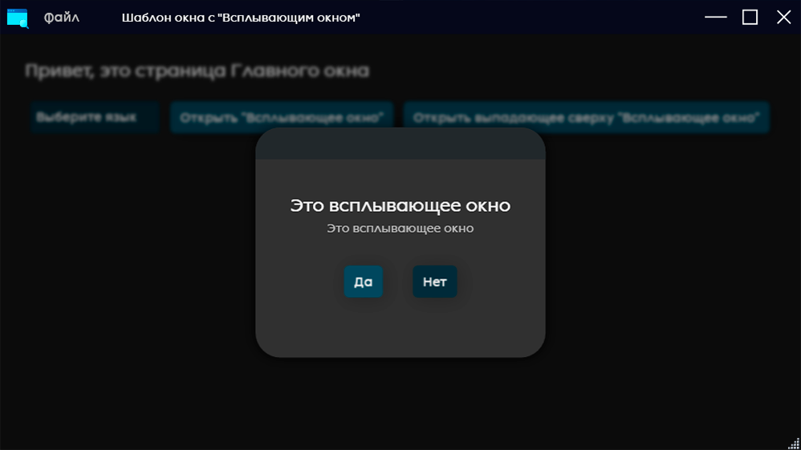

### **Языки**

 [](Readme.ru-RU.md)
 [](Readme.md)

# **Шаблон проекта с поп-ап**

## **Скриншоты**





## **Содержание**
* [**Описание проекта**](Readme.ru-RU.md#Описание-проекта)

* [**Установка**](Readme.ru-RU.md#Установка)

* [**Описание структуры**](Readme.ru-RU.md#Описание-структуры)

* [**Описание взаимодействия с темой приложения**](Readme.ru-RU.md#Описание-взаимодействия-с-темой-приложения)

   - [Изменения цветов](Readme.ru-RU.md#Изменения-цветов)
   - [Изменение иконок](Readme.ru-RU.md#Изменение-иконок)
   - [Изменение шрифтов](Readme.ru-RU.md#Изменение-шрифтов)
   - [Изменение размеров](Readme.ru-RU.md#Изменение-размеров)

* [**Описание взаимодействия с файлами локализации**](Readme.ru-RU.md#Описание-взаимодействия-с-файлами-локализации)

   - [Добавление строк](Readme.ru-RU.md#Добавление-строк)
   - [Описание работы функции локализации](Readme.ru-RU.md#Описание-работы-функции-локализации)

* [**Описание взаимодействия с поп-апами**](Readme.ru-RU.md#Описание-взаимодействия-с-поп-апами)

   - [Описание механики поп-апов](Readme.ru-RU.md#Описание-механики-поп-апов)
   - [Вызов выподающего сверху поп-апа](Readme.ru-RU.md#Вызов-выподающего-сверху-поп-апа)
   - [Вызов поп-апа](Readme.ru-RU.md#Вызов-поп-апа)

* [**Сочитания клавиш**](Readme.ru-RU.md#Сочитания-клавиш)

   - [Добавление сочитания клавиш](Readme.ru-RU.md#Добавление-сочитания-клавиш)

* [**Заключение**](Readme.ru-RU.md#Заключение)

## **Описание проекта**
Данный проект представляет из себя простой шаблон для C# WPF приложений включающий в себя следующие базовые функции:

 * Красивове отображение поп-ап
 * Сохранение настроек окна
 * Возможность локализации
 * Добавление сочетания клавиш

Так же этот проект по умолчанию использует __MaterialDesignThemes.Wpf__ и __MaterialDesignColors.Wpf__

А так же __.NetFramework 4.7.2__

## **Установка**
Вам не нужно каждый раз создавая проект заново прописывать базовые структуры и функции. Достаточно скачать этот рипозиторий

```console
git clone https://github.com/kenuel0110/-WPF-C-Window-Template-With-Popup.git
```

## **Описание структуры**
Этот шаблон уже имеет некоторую структуру, которую вы можете подстроить под себя.
***
Структура папки ```Classes``` 

<div style="border: 1px solid black; padding: 10px; margin-bottom: 20px;">
    <ul>
        <li>Classes</li>
        <ul>
            <li>Constants.cs</li>
            <li>Data_Classes.cs</li>
            <li>Enums.cs</li>
        </ul>
    </ul>
</div>

***
Папка ```Classes``` содержит классы и константы используемые в приложении

> Constants.cs — В этом файле содержаться все названия папок и файлов, а так же названия ресурса для функции ```FindResource()```

> Data_Classes.cs — В этом файле содержаться все классы для формирования и чтения JSON, а так же внутрение классы

> Enums.cs — В этом файле содержаться все "перечисления", используемые внутри программы 
***
Структура папки ```Fonts``` 

<div style="border: 1px solid black; padding: 10px; margin-bottom: 20px;">
    <ul>
        <li>Fonts</li>
        <ul>
            <li>Lackitalic.ttf</li>
            <li>Lackregular.ttf</li>
        </ul>
    </ul>
</div>

***
Папка ```Fonts``` содержит все шрифты, используемые приложением
***
Структура папки ```Funcs``` 

<div style="border: 1px solid black; padding: 10px; margin-bottom: 20px;">
    <ul>
        <li>Funcs</li>
        <ul>
            <li>MainWindow_Funcs.cs</li>
            <li>Popups_Funcs.cs</li>
        </ul>
    </ul>
</div>

***
Папка ```Funcs``` содержит все функции-хэлперы приложения

> MainWindow_Funcs.cs — В этом файле содержаться все функции используемые внутри ```MainWindow.xaml.cs``` и связанные с главным окном

> Popups_Funcs.cs — В этом файле содержаться все функции используемые внутри поп-апов и связанные с ними
***

Структура папки ```Icons``` 

<div style="border: 1px solid black; padding: 10px; margin-bottom: 20px;">
    <ul>
        <li>Icons</li>
        <ul>
            <li>btn_close.png</li>
            <li>btn_hide.png</li>
            <li>btn_maximilize.png</li>
            <li>btn_restore.png</li>
            <li>logo_window.png</li>
        </ul>
    </ul>
</div>

***
Папка ```Icons``` содержит все иконки используемые внутри приложения
***
Структура папки ```Pages``` 

<div style="border: 1px solid black; padding: 10px; margin-bottom: 20px;">
    <ul>
        <li>Pages</li>
        <ul>
            <li>Page_main.xaml</li>
            <li>Page_main.xaml.cs</li>
        </ul>
    </ul>
</div>

***
Папка ```Pages``` содержит все страницы используемые в приложении

> Page_main — главная страница приложения, которая открывается первой внутри окна
***
Структура папки ```Popups``` 

<div style="border: 1px solid black; padding: 10px; margin-bottom: 20px;">
    <ul>
        <li>Popups</li>
        <ul>
            <li>Popup_question.xaml</li>
            <li>Popup_question.xaml.cs</li>
            <li>Popup_slidedown_info.xaml</li>
            <li>Popup_slidedown_info.xaml.cs</li>
        </ul>
    </ul>
</div>

***
Папка ```Popups``` содержит все поп-апы, используемые внутри приложения. Они реализованы в виде страниц для удобства работы с ними

> Popup_question — Этот поп-ап представляет из себя стандартный поп-ап диалога "ДА/НЕТ"

> Popup_slidedown_info — Этот поп-ап представляет из себя выползающий сверху поп-ап для отображения любого текста
***
Структура папки ```Strings``` 

<div style="border: 1px solid black; padding: 10px; margin-bottom: 20px;">
    <ul>
        <li>Strings</li>
        <ul>
            <li>Strings.en-EN.xaml</li>
            <li>Strings.ru-RU.xaml</li>
        </ul>
    </ul>
</div>

***
Папка ```Strings``` содержит все ресурсы, используемые для локализации приложения

> Strings.en-EN.xaml — В этом файле содержаться все строчки на английском языке

> Strings.ru-RU.xaml — В этом файле содержаться все строчки на русском языке
***

Структура файлов внутри корневой папки ```WindowTemplateWithPopup```

<div style="border: 1px solid black; padding: 10px; margin-bottom: 20px;">
    <ul>
        <li>App.config</li>
        <li>App.xaml</li>
        <li>App.xaml.cs</li>
        <li>MainWindow.xaml</li>
        <li>MainWindow.xaml.cs</li>
        <li>packages.config</li>
    </ul>
</div>

> App.xaml — В этом файле содержаться вся тема для приложения, то есть все цвета, шрифты, размеры и т.д.

> App.xaml.cs — В этом файле содержаться функции связаные с локализацией

> MainWindow — Это главное окно приложения

## **Описание взаимодействия с темой приложения**

### Изменения цветов

```xml
<!--App.xaml-->
<!--Colors-->
<Color x:Key="PrimaryColor">#FF8C1857</Color>
<Color x:Key="SecondaryColor">#FF520931</Color>
<Color x:Key="Background">#202020</Color>
<Color x:Key="Background_Dark">#0e101f</Color>
<Color x:Key="Background_Popup">#333333</Color>
<Color x:Key="Background_Button_TitleBar">#3f3f41</Color>
<Color x:Key="Background_Button_Hover_TitleBar">#3f3f41</Color>
<Color x:Key="Background_Button_Close">#6a000d</Color>
<Color x:Key="Background_Button_Main">#1d495d</Color>
<Color x:Key="Background_Button_Accent">#122E3B</Color>
<Color x:Key="Background_Button_Hover_Accent">#0E212A</Color>
<Color x:Key="Background_Button_Hover_Main">#091820</Color>
<Color x:Key="Background_Context_menu">#FF222222</Color>
<Color x:Key="Foreground_Header">#f1f1f1</Color>
<Color x:Key="Foreground_Text">#bebebe</Color>
<Color x:Key="Background_Popup_Titlebar">#282c2f</Color>
```
> Данный блок внутри ```App.xaml``` отвечает за изменение цветов приложения

Структура:

* ```Background / Foreground / и т.д.``` отмечает где будет отображаться цвет
* ```Text / Header / Button / и т.д.``` отмечает элемент где будет отображаться цвет
* приписка ```_Hover_``` отмечает цвет при наведении
* приписка ```_Accent_``` отмечает более акцентный цвет, для возможных элементов интерфеса

### Изменение иконок
```xml
<!--App.xaml-->
<!--Icons-->
<BitmapImage x:Key="ic_logo" UriSource="/Icons\logo_window.png"/>
<BitmapImage x:Key="ic_hide" UriSource="/Icons\btn_hide.png"/>
<BitmapImage x:Key="ic_maximilize" UriSource="/Icons\btn_maximilize.png"/>
<BitmapImage x:Key="ic_close" UriSource="/Icons\btn_close.png"/>
<!--=====-->
```
> Данный блок внутри ```App.xaml``` отвечает за добавление картинок и удобный доступ к ним внутри ресурсов приложения

### Изменение шрифтов
```xml
<!--App.xaml-->
<!--Fonts-->
<FontFamily x:Key="LackRegular">/Fonts/Lackregular.ttf #Lack Regular</FontFamily>
<FontFamily x:Key="LackItalic">/Fonts/Lackitalic.ttf #Lack Italic</FontFamily>
<!--=====-->
```
> Данный блок внутри ```App.xaml``` отвечает за добавление шрифтов и удобный доступ к ним внутри ресурсов приложения

### Изменение размеров
```xml
<!--App.xaml-->
<!--Sizes-->
<CornerRadius x:Key="size_CornerRadiusValue">25</CornerRadius>
<CornerRadius x:Key="size_CornerRadiusSlidedownPopup">8</CornerRadius>
<CornerRadius x:Key="size_CornerRadiusPopupTitlebar">25 25 0 0</CornerRadius>
<CornerRadius x:Key="size_CornerRadiusButton">5</CornerRadius>
<sys:Double x:Key="size_textblock_header">18</sys:Double>
<sys:Double x:Key="size_textblock_text">14</sys:Double>
<sys:Double x:Key="size_textblock_title_window">12</sys:Double>
<sys:Double x:Key="size_button_text">13</sys:Double>
<sys:Double x:Key="size_control_button_height">34</sys:Double>
<sys:Double x:Key="size_control_button_width">34</sys:Double>
<sys:Double x:Key="size_control_popup_button_height">24</sys:Double>
<sys:Double x:Key="size_control_popup_button_width">24</sys:Double>
<Thickness x:Key="size_control_image_margin">6</Thickness>
<sys:Double x:Key="size_shadow_button">6</sys:Double>
<sys:Double x:Key="size_shadow_depth_button">3</sys:Double>
<sys:Double x:Key="size_shadow_opacity_button">0.2</sys:Double>
<Thickness x:Key="size_small_padding">5</Thickness>
<Thickness x:Key="size_medium_padding">25</Thickness>
<sys:Double x:Key="size_minheight">64</sys:Double>
<sys:Double x:Key="size_minwidth">128</sys:Double>
<Thickness x:Key="size_small_margin">5</Thickness>
<Thickness x:Key="size_medium_margin">25</Thickness>
<!--=====-->
```
> Данный блок внутри ```App.xaml``` отвечает за шаблонов для размеров разных элементов пользовательского интерфейса

Структура:

* ```size``` отмечает что это размер
* приписка ```medium / small / и т.д.``` отмечает какой силы отступ
* ```control_image / padding / и т.д.``` отмечает элемент где будет применён размер

### Добавление языков

```xml
<!--App.xaml-->
<ResourceDictionary.MergedDictionaries>

    <!--Language-->
    <ResourceDictionary Source="/Strings/Strings.en-EN.xaml"/>
    <ResourceDictionary Source="/Strings/Strings.ru-RU.xaml"/>
    <!--========-->

    <!-- ... -->

</ResourceDictionary.MergedDictionaries>
```
> Данный блок внутри ```App.xaml``` отвечает за добавление файлов с локализацией внутрь ресурсов приложения

  >__[ВАЖНАЯ ИНФОРМАЦИЯ ОБ СТРУКТУРЕ И НАЗВАНИИ ФАЙЛОВ ЛОКАЛИЗАЦИИ](###!Важная-информация!)__

### Изменение размеров
```xml
<!--App.xaml-->
<!--Sizes-->
<ResourceDictionary.MergedDictionaries>

    <!-- ... -->

    <ResourceDictionary Source="pack://application:,,,/MaterialDesignThemes.Wpf;component/Themes/MaterialDesignTheme.Light.xaml" />
    <ResourceDictionary Source="pack://application:,,,/MaterialDesignThemes.Wpf;component/Themes/MaterialDesignTheme.Defaults.xaml" />
    <ResourceDictionary Source="pack://application:,,,/MaterialDesignColors;component/Themes/Recommended/Primary/MaterialDesignColor.DeepPurple.xaml" />
    <ResourceDictionary Source="pack://application:,,,/MaterialDesignColors;component/Themes/Recommended/Accent/MaterialDesignColor.Lime.xaml" />
    <materialDesign:CustomColorTheme BaseTheme="Dark" PrimaryColor="#1d495d" SecondaryColor="#122e3b" />

</ResourceDictionary.MergedDictionaries>
```
> Данный блок внутри ```App.xaml``` отвечает за добавление MaterialDesign в проект, а так же позволяет выбрать ```PrimaryColor``` и ```SecondaryColor``` для приложения (данные цвета отвечают за некоторые не редактирумые элементы интерфеса, такие как стрелочка ComboBox и т.п.)

## **Описание взаимодействия с файлами локализации**

### Добавление строк
```xml
<!--Strings.en-EN.xaml-->
<ResourceDictionary xmlns="http://schemas.microsoft.com/winfx/2006/xaml/presentation"
xmlns:x="http://schemas.microsoft.com/winfx/2006/xaml"
xmlns:system="clr-namespace:System;assembly=mscorlib"
xmlns:local="clr-namespace:WindowTemplateWithPopup.Strings">
    <!--Title window-->
    <system:String x:Key="window_title">Window template with "Pop-up"</system:String>
    <!--Window file button button-->
    <system:String x:Key="window_btn_file">File</system:String>
    <!--Change language combobox-->
    <system:String x:Key="cb_select_language">Select language</system:String>
    <!--Greeteng string-->
    <system:String x:Key="greeteng">Hello, it`s page of Main Window</system:String>
    <!--Button "open popup" string-->
    <system:String x:Key="btn_open_popup">Open Popup</system:String>
    <!--Button "open small slide-down popup" string-->
    <system:String x:Key="btn_open_small_popup">Open slide-down Popup</system:String>
    <!--Button "change language" string-->
    <system:String x:Key="button_change_language">Change Language</system:String>
    <!--Greeteng popup string-->
    <system:String x:Key="popup_greeteng">It`s popup</system:String>
    <!--Window menu "new file" string-->
    <system:String x:Key="window_menu_new">New</system:String>
    <!--Window menu "Open file..." string-->
    <system:String x:Key="window_menu_open">Open...</system:String>
    <!--Window change language-->
    <system:String x:Key="window_change_language">Restart app to set changes</system:String>
    <!--Popup button accept-->
    <system:String x:Key="popup_accept">Yes</system:String>
    <!--Popup button cancel-->
    <system:String x:Key="popup_cancel">No</system:String>
</ResourceDictionary>
```
> Данный блок внутри ```Strings.en-EN.xaml``` отвечает за добавление локализованых строчек в проект

Структура:

<div style="border: 1px solid black; padding: 10px; margin-bottom: 20px;">
    <ul>
        <li>&lt;ResourceDictionary&gt;</li>
        <ul>
            <li>&lt;system:String x:Key="1"&gt;1&lt;/system:String&gt;</li>
            <li>&lt;system:String x:Key="2"&gt;2&lt;/system:String&gt;</li>
             <li>&lt;system:String x:Key="3"&gt;3&lt;/system:String&gt;</li>
            <li>...</li>
            <li>&lt;system:String x:Key="n"&gt;n&lt;/system:String&gt;</li>
        </ul>
        <li>&lt;/ResourceDictionary&gt;</li>
    </ul>
</div>

Файл ```Strings.nn-NN.xaml``` где ```nn-NN``` — языковой код, содержит все строчки используемые в приложение на языке ```nn-NN```

> ```x:Key=""``` — Это ключ для строчки

> ```<system:String>...</system:String>``` — между этими тэгами пишется строчка

__Ключи на строчек на разных языках должны совпадать, то есть:__

<div style="border: 1px solid black; padding: 10px; margin-bottom: 20px;">
    <b>Strings.en-EN.xaml</b>
    <br><br>
    <ul>
        <li>&lt;ResourceDictionary&gt;</li>
        <ul>
            <li>&lt;system:String x:Key="one"&gt;<b>one</b>&lt;/system:String&gt;</li>
            <li>&lt;system:String x:Key="two"&gt;<b>two</b>&lt;/system:String&gt;</li>
             <li>&lt;system:String x:Key="three"&gt;<b>three</b>&lt;/system:String&gt;</li>
            <li>&lt;system:String x:Key="four"&gt;<b>four</b>&lt;/system:String&gt;</li>
        </ul>
        <li>&lt;/ResourceDictionary&gt;</li>
    </ul>
    <br>
    <br>
    <b>Strings.ru-RU.xaml</b>
    <br><br>
    <ul>
        <li>&lt;ResourceDictionary&gt;</li>
        <ul>
            <li>&lt;system:String x:Key="one"&gt;<b>один</b>&lt;/system:String&gt;</li>
            <li>&lt;system:String x:Key="two"&gt;<b>два</b>&lt;/system:String&gt;</li>
             <li>&lt;system:String x:Key="three"&gt;<b>три</b>&lt;/system:String&gt;</li>
            <li>&lt;system:String x:Key="four"&gt;<b>четыре</b>&lt;/system:String&gt;</li>
        </ul>
        <li>&lt;/ResourceDictionary&gt;</li>
    </ul>

</div>

### __!Важная информация!__

>__Файлы с локализацией должны находиться чтрого в папке ```Strings/``` и иметь следующую структуру названия:__

<div style="border: 1px solid black; padding: 10px; margin-bottom: 20px;">
<b>Strings.ЯЗЫКОВОЙ_ТЕГ.xaml</b>
</div>

Где __ЯЗЫКОВОЙ_ТЕГ__ — ```сокращение языка-сокращение региона``` по типу:
<div style="border: 1px solid black; padding: 10px;">
    <ul>
        <li>ru-RU</li>
        <li>en-EN</li>
        <li>fr-FR</li>
    </ul>
    <b Style="margin-left: 25px;">и т.д.</b>
</div>

### Описание работы функции локализации
```C#
//App.xaml.cs
static void SelectCulture(string culture)
{
    MainWindow mainWindow = App.Current.MainWindow as MainWindow;
    if (String.IsNullOrEmpty(culture))
        return;
    // Копируем все MergedDictionarys во вспомогательный список.
    var dictionaryList = Application.Current.Resources.MergedDictionaries.ToList();
    // Ищем указанную культуру.     
    string requestedCulture = string.Format("/Strings/Strings.{0}.xaml", culture);
    var resourceDictionary = dictionaryList.FirstOrDefault(d =>
    d.Source != null &&
    !string.IsNullOrEmpty(d.Source.OriginalString) &&
    d.Source.OriginalString == requestedCulture);
    if (resourceDictionary == null)
    {
        // Если не найдено, выбираем наш язык по умолчанию.
        requestedCulture = "/Strings/Strings.en-EN.xaml";
        resourceDictionary = dictionaryList.FirstOrDefault(d =>
            d.Source != null &&
            !string.IsNullOrEmpty(d.Source.OriginalString) &&
            d.Source.OriginalString == requestedCulture);
    }
    // Если у нас есть запрошенный ресурс, удаляем его из списка и помещаем в конец.     
    // Затем этот язык станет нашей таблицей строк для использования.      
    if (resourceDictionary != null)
    {
        Application.Current.Resources.MergedDictionaries.Remove(resourceDictionary);
        Application.Current.Resources.MergedDictionaries.Add(resourceDictionary);
    }
    // Сообщаем потокам о новой культуре.     
    Thread.CurrentThread.CurrentCulture = new CultureInfo(culture);
    Thread.CurrentThread.CurrentUICulture = new CultureInfo(culture);
    mainWindow.systemLanguage = culture;
}
```

Функции ```App.SelectCulture()``` нужно передать языковой тег, язык которого пользователь хочет установить в программе

> В этом шаблоне язык по умолчанию английский, но это легко можно изменить прописав другой файл

В данном шаблоне предоставлена простая реализация выбора языка исходя из тех языков, которые прописаны в ресурсах

Для поиска языков прописаных в ресрсах приложения используется функция ```App.availableCultures()```

```C#
//App.xaml.cs
public static List<string> availableCultures()
{
    List<string> availableCultures = new List<string>();
    var dictionaryList = Application.Current.Resources.MergedDictionaries.ToList();
    try
    {
        foreach (ResourceDictionary dictionary in dictionaryList)
        {
            string source = dictionary.Source.OriginalString;
            if (source.StartsWith("/Strings/Strings.") && source.EndsWith(".xaml"))
            {
                string cultureCode = source.Substring(17, source.Length - 22); // Получение языкового тега
                availableCultures.Add(cultureCode);
            }
        }
    }
    catch { }
    return availableCultures;
}
```

Функция ```App.availableCultures()``` возвращает список языковых тегов, файл локализации, которой занесён в ресурсы приложения

> Эту функцию важно запустить перед прогрузкой главного окна, чтобы программа получила доступ ко всем файлам локализации, иначе уже выбранный язык приложения будет пропущен и не отобразится в списке!

***

```C#
//MainWindow.xaml.cs
public void localization(string language_state) 
{
    App.SelectCulture(language_state);
    mainwindow_funcs.saveJSONSetting(
        new Classes.Data_Classes.JSON_Setting
        {
            maximilize_window = window_state,
            size_window = new List<double>() { newWindowHeight, newWindowWidth },
            position_window = new List<double>() { newWindowPosX, newWindowPosY },
            window_language = language_state
        })
    //reastart app
    System.Windows.Application.Current.Shutdown();
    Thread.Sleep(100);
    System.Diagnostics.Process.Start(Application.ResourceAssembly.Location);
}
```

В данном шаблоне представлена простая система, позволяющая не только сменить культуру приложения, так и обновить элементы интерфейса

Функция ```localization()``` находиться в ```MainWindow.xaml.cs``` и сразу после изменения культуры автоматически перезапускает приложение, чтобы обновить все элементы интерфейса

> Чтобы получить строку из ресурсов приложения в коде нужно использовать функцию ```FindResource()```

```C#
//ручное обновление некоторых элементов интерфейса
title_window.Text = FindResource(constants.window_title).ToString();
btn_file.Content = FindResource(constants.window_btn_file).ToString();
btn_file_new.Header = FindResource(constants.window_menu_new).ToString();
btn_file_open.Header = FindResource(constants.window_menu_open).ToString();
```

Для удобства все ключи ресурсов прописаны в ```Classes.Constants.cs```

> Чтобы получить строку из ресурсов приложения в разметке нужно обратится в ```StaticResource```

```xml
<Button.ContextMenu>
    <ContextMenu Name="btn_file_cm" Style="{StaticResource button_menu_context_menu}">
        <MenuItem Name="btn_file_new" Header="{StaticResource window_menu_new}"/>
        <MenuItem Name="btn_file_open" Header="{StaticResource window_menu_open}"/>
    </ContextMenu>
</Button.ContextMenu>
```

## **Описание взаимодействия с поп-апами**

### Описание механики поп-апов

Механика поп-апов работает следующим образом. Внитри ```MainwWindow.xaml``` созданно три ```Frame``` элемента:
* __main_frame__
* __popup_slide_frame__
* __popup_frame__

```main_frame``` — Главный фрейм, в котором открываются страницы

```popup_slide_frame``` — Фрейм, в котором открывается выпадающий сверху поп-ап

```popup_frame``` — Фрейм, в котором открываються обычные поп-апы (всплывающие окна)

Так же есть элемент ```Border``` под именем ```border_shadow```, он нужен для добавления эффекта затемнения при открытии поп-апов

> По сути все поп-апы являються такими же страницами, что позволяет вам делать их обособлеными от контента страницы или окна в котором он должен использоваться, а так же позволяет повторно использовать один и тот же поп-ап в разных ситуациях

По умолчанию все дополнительные ```Frame``` не отображаються (отображается только ```main_frame```), как и ```border_shadow```, появляясь только тогда, когда нужно

### Вызов выподающего сверху поп-апа
Вызов выпадающего сверху поп-апа, происходит за счёт функции ```Funcs.Popups_Funcs.showpopup()```. Она принимает тип поп-апа и информацию, которую нужно отобразить

```C#
//Funcs.Popups_Funcs
public async void showpopup(Classes.Enums.Popups popup = Classes.Enums.Popups.None, string info = "") 
{
    switch (popup) 
    {
        case Classes.Enums.Popups.SlideDown:
            mainWindow.popup_slide_frame.Visibility = Visibility.Visible;
            mainWindow.popup_slide_frame.NavigationService.Navigate(new Popups.Popup_slidedown_info(info));
            break
        case Classes.Enums.Popups.Popup:
            bool result = await mainWindow.open_popup();
            if (result == true)
            {
                showpopup(Classes.Enums.Popups.SlideDown, info.Split()[0].ToString());
            }
            else
            {
                showpopup(Classes.Enums.Popups.SlideDown, info.Split()[1].ToString());
            }
            break;
    }
}
```

> Все типы поп-апов прописаны в ```Classes.Enums.cs```

```C#
//Classes.Enums.cs
public enum Popups
{
    None = 0,
    SlideDown = 1,
    Popup = 2
}
```

На данный момент их три:
* None — Пустой
* SlideDown — Выпадающий сверху поп-ап
* Popup — Всплывающее окно

> В данном шаблоне поп-ап выполнен в виде диалогового окна ДА/НЕТ, но его можно разделить ещё на несколько типов, если вам нужно

Для отображения выпадающего сверху поп-апа достаточно вызвать функцию ```Funcs.Popups_Funcs.showpopup()``` с  типом поп-апа ```Classes.Enums.Popups.SlideDown```

```Page_main.xaml.cs
private void btn_open_small_popup_Click(object sender, RoutedEventArgs e)
{
    popups_funcs.showpopup(Classes.Enums.Popups.SlideDown, FindResource(constants.popup_greeteng).ToString());
}
```

В данном случае, откроется поп-ап ```Popups.Popup_slidedown_info```

Для закрытия выпадающего сверху поп-апа используется функция ```Funcs.Popups_Funcs.hideslidedownpopup()```

### Вызов поп-апа
Вызов поп-апа, происходит за счёт функции ```Funcs.Popups_Funcs.showpopup()```. Она принимает тип поп-апа и информацию, которую нужно отобразить

```C#
//Funcs.Popups_Funcs
public async void showpopup(Classes.Enums.Popups popup = Classes.Enums.Popups.None, string info = "") 
{
    switch (popup) 
    {
        case Classes.Enums.Popups.SlideDown:
            mainWindow.popup_slide_frame.Visibility = Visibility.Visible;
            mainWindow.popup_slide_frame.NavigationService.Navigate(new Popups.Popup_slidedown_info(info));
            break
        case Classes.Enums.Popups.Popup:
            bool result = await mainWindow.open_popup();
            if (result == true)
            {
                showpopup(Classes.Enums.Popups.SlideDown, info.Split()[0].ToString());
            }
            else
            {
                showpopup(Classes.Enums.Popups.SlideDown, info.Split()[1].ToString());
            }
            break;
    }
}
```

> Все типы поп-апов прописаны в ```Classes.Enums.cs```

```C#
//Classes.Enums.cs
public enum Popups
{
    None = 0,
    SlideDown = 1,
    Popup = 2
}
```

На данный момент их три:
* None — Пустой
* SlideDown — Выпадающий сверху поп-ап
* Popup — Всплывающее окно

> В данном шаблоне, поп-ап выполнен в виде диалогового окна ДА/НЕТ, но его можно разделить ещё на несколько типов, если вам нужно

Для отображения поп-апа достаточно вызвать функцию ```Funcs.Popups_Funcs.showpopup()``` с  типом поп-апа ```Classes.Enums.Popups.Popup```

```C#
//Page_main.xaml.cs
private void btn_open_popup_Click(object sender, RoutedEventArgs e)
{
    popups_funcs.showpopup(Classes.Enums.Popups.Popup, FindResource(constants.popup_accept) + " " + FindResource(constants.popup_cancel));
}
```

В данном случае, откроется поп-ап ```Popups.Popup_question```

> В данном шаблоне, реализация поп-апа диалога сделана засчёт события созданого с помощью ```TaskCompletionSource``` в ```MainWindow.xaml.cs```

```C#
//MainWindow.xaml.cs
//функция открытия поп-апа
public async Task<bool> open_popup()
{
    blurBackground();
    popup_frame.Visibility = Visibility.Visible;
    Popups.Popup_question popup_question = new Popups.Popup_question();
    popup_frame.NavigationService.Navigate(popup_question);
    tcs = new TaskCompletionSource<bool>()
    // ожидание, пока переменная измениться
    bool result = await tcs.Task;
    return result;
}
```

> Пока переменная ```result``` не изменится программа не продолжится. То есть, пока пользователь нажатием на кнопку диалога не изменит ```result``` поп-ап не закроется, реализуя функционал диалога

Чтобы изменить переменую ```result``` в файле поп-апа (в данном случае ```Popups.Popup_question.xaml.cs```), нам нужно обратится к функции ```MainWindow.xaml.cs``` под названием ```SetDialogResult_popup()```

```C#
//Popups.Popup_question.xaml.cs
//Функция кнопки "да"
private void btn_accept_Click(object sender, RoutedEventArgs e)
{
    mainWindow.popup_frame.Visibility = Visibility.Hidden;
    mainWindow.deblurBackground();
    if (NavigationService.CanGoBack)
        NavigationService.GoBack();
    ((MainWindow)Application.Current.MainWindow).SetDialogResult_popup(true);
}

//Функция кнопки "нет"
private void btn_cancel_Click(object sender, RoutedEventArgs e)
{
    mainWindow.popup_frame.Visibility = Visibility.Hidden;
    mainWindow.deblurBackground();
    if (NavigationService.CanGoBack)
        NavigationService.GoBack();
    ((MainWindow)Application.Current.MainWindow).SetDialogResult_popup(false);
}
```

Для каждого поп-апа в ```MainWindow.xaml.cs``` должна быть своя функция ```SetDialogResult_popup()```, которая выглядит следующим образом

```C# 
//MainWindow.xaml.cs
internal void SetDialogResult_popup(bool result)
{
    setdialogResult_popup = result;
    if (result == true)
        tcs.SetResult(true);
    else
        tcs.SetResult(false);
    tcs.TrySetCanceled();
}
```

Для удобства советую сделать в регионе ```private_varibles``` следующие переменные

```C#
//MainWindow.xaml.cs
//local keys for popup
private bool setdialogResult_popup;
private TaskCompletionSource<bool> tcs;

#endregion
```

> Так же для каждого поп-апа (кроме выпадающего сверху) нужно создавать свою ```bool``` переменную

> Переменую ```TaskCompletionSource<bool> tcs``` можно создать один раз, она не привязывается к поп-апу

## **Сочитания клавиш**

### Добавление сочитания клавиш

Сочитание клавиш добавляеться и в ```MainWindow.xaml``` и в ```MainWindow.xaml.cs```

```xml
<!--MainWindow.xaml-->
<Window.CommandBindings>
    <CommandBinding Command="{x:Static local:MainWindow.MyCommand}" Executed="MyCommandExecuted"/>
</Window.CommandBindings>
```

Где ```Command={x:Static local:MainWindow.MyCommand}``` это переменая типа ```RoutedCommand```, указаная в ```MainWindow.xaml.cs```

```C# 
//MainWindow.xaml.cs
public static RoutedCommand MyCommand = new RoutedCommand();
//...

//функция инициализации
private void init()
{
    //...
    //Заполнение переменной MyCommand
    MyCommand.InputGestures.Add(new KeyGesture(Key.S, ModifierKeys.Control));
}
```

А ```Executed="MyCommandExecuted"``` это функция, прописаная в ```MainWindow.xaml.cs```, которая будет выполнятся при нажатии на это сочитание клавиш

```C#
//Функция сочитания клавиш
private async void MyCommandExecuted(object sender, ExecutedRoutedEventArgs e)
{
    MessageBox.Show("Сочетание клавиш");
}
```

## **Заключение**

Данный проект создан для упрощения рутиной части, создания нового проекта. Я уверен что реализованные механики можно оптимизировать ещё лучше и сделать более универсальными, поэтому если у вас есть какие-нибудь замечания не бойтесь ими делиться

> Не факт что вам подойдёт данное решение, но в нём вы можете без труда подсмотреть реализацию тех или иных базовых механик

***
<p align="center"></p>
